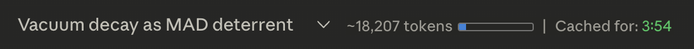
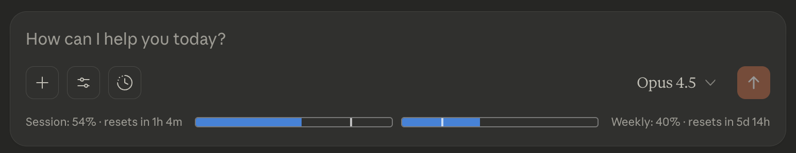

# Claude Counter (minimal fork)

This is a **minimal fork** of the original [Claude Usage Tracker](https://github.com/lugia19/Claude-Usage-Extension) extension by **lugia19**.

The goal of this fork is:

- Keep a **simple, reliable view** of what matters while you’re chatting on `claude.ai`:
  - per‑conversation token length
  - cache timer
  - native session + weekly usage bars
- **Remove** the original cross‑device usage tracking (Firebase) and most of the heavier UI.

Also check out the original author’s other extension, [Claude QoL](https://github.com/lugia19/Claude-QoL) (summarizing, TTS, STT, etc.).

## Current features (this fork)

All features are focused on `claude.ai` itself:

- **Per‑conversation token length**
  - Shows the total tokens in the current conversation.
  - Adds a small progress bar showing usage against the 200,000‑token context window limit.

- **Cache timer**
  - Shows how long the conversation is still considered **cached** by Claude.
  - Countdown updates every second (`Cached for: m:ss`).

- **Native session & weekly usage bars**
  - Uses Claude’s own internal `/usage` API (`/organizations/{orgId}/usage`) as the **single source of truth**.
  - Displays:
    - **Session (≈5‑hour) usage** – percentage, “resets in …” countdown, usage bar, and a vertical tick showing how far through the session window you are.
    - **Weekly (7‑day) usage** – same pattern for all‑models weekly limits.
  - The bars update:
    - After each new message (once Claude has updated its usage).
    - Continuously for the “resets in …” countdown and time markers.
  - Clicking anywhere on the session/weekly line manually refreshes the usage data and shows a brief visual dimming while refreshing.

- **Tooltips for everything important**
  - Token count + mini bar.
  - Cache timer.
  - Session & weekly labels and bars.
  - Each explains what the value means and how to read the visuals (usage vs time markers).

## UI preview

- **Header** (tokens + cache timer)  
  

- **Composer area** (session & weekly usage bars)  
  

## What’s different from the original extension

Compared to the original Claude Usage Tracker:

- **Removed**
  - Firebase‑based cross‑device usage sync and the per‑model “tokens tracked” backend.
  - Sidebar usage UI, progress bars, and reset management.
  - “Messages left” estimates and cost/credits display.
  - Update/donation notification card logic.

- **Changed**
  - Usage information is now read from Claude’s **native usage API** instead of being reconstructed by the extension.
  - The chat header is simplified:
    - Only shows conversation tokens + a small bar + cache timer.
    - Session/weekly usage lives in a single line under the model selector.

- **Kept (in a minimal way)**
  - Local token counting (with optional Anthropic API key) is still used to estimate conversation length, but **not** to track or sync usage caps.
  - Some of the legacy Firebase/usage code is still present in the codebase for compatibility, but it is no longer fed with new usage data in this fork.

If you want the full cross‑device tracking, sidebar UI, and more advanced usage analytics, you should use the original extension instead.

## Installation

This fork is primarily intended as a **developer / power‑user build**.

- **Chrome / Edge (unpacked)**
  1) Clone or download this repo.
  2) Go to `chrome://extensions` (or Edge extensions).
  3) Enable *Developer mode*.
  4) Click *Load unpacked* and select this folder.

- **Firefox (temporary add-on)**
  1) Clone or download this repo.
  2) Go to `about:debugging#/runtime/this-firefox`.
  3) Click *Load Temporary Add-on* and select any file in the folder.

- **Browser-specific manifests** (optional)
  - `manifest_chrome.json` and `manifest_firefox.json` are optimized for each browser.
  - To use one, rename it to `manifest.json` (replacing the default).
  - The Firefox version includes `webRequestBlocking` for container support.

- **Store versions**
  - The Chrome/Firefox listings in the original README point to the **original** extension (full-featured, with Firebase usage sync).  
  - If you want the published, fully supported version, use those links in `original-extension/README.md`.  
  - If you want this minimal fork, install it unpacked as above.

## Privacy notes

Key differences vs the original:

- This fork **no longer uploads your usage totals to Firebase** or tries to merge usage between devices.
- Session and weekly usage bars are based solely on Claude’s **own `/usage` endpoint**, which Claude already uses to render its Usage page.
- The extension still:
  - Reads your `lastActiveOrg` cookie to know which org to query for `/usage`.
  - Makes normal requests to `claude.ai` and (optionally, if you configure it) `api.anthropic.com` for token counting.

For broader privacy details, you can still refer to the original [privacy policy](PRIVACY.md), but be aware that the Firebase usage‑sync behavior described there does **not** apply in this minimal fork.
